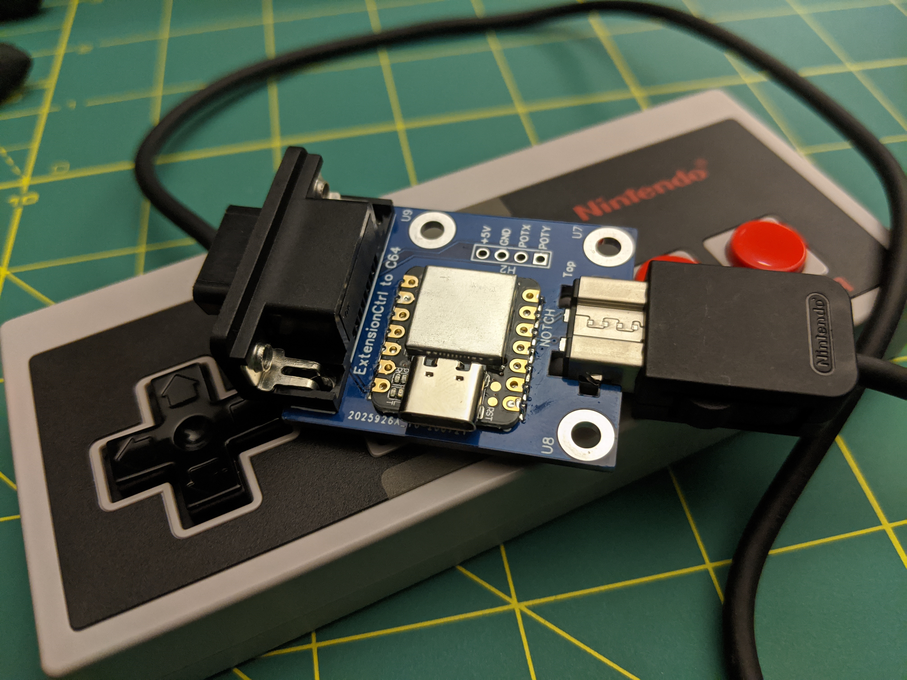
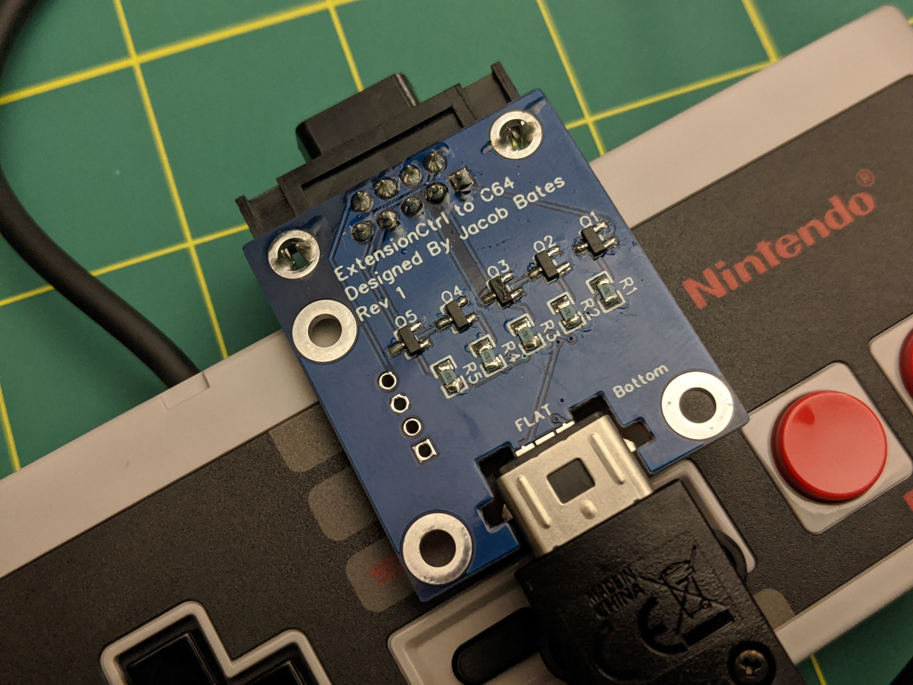
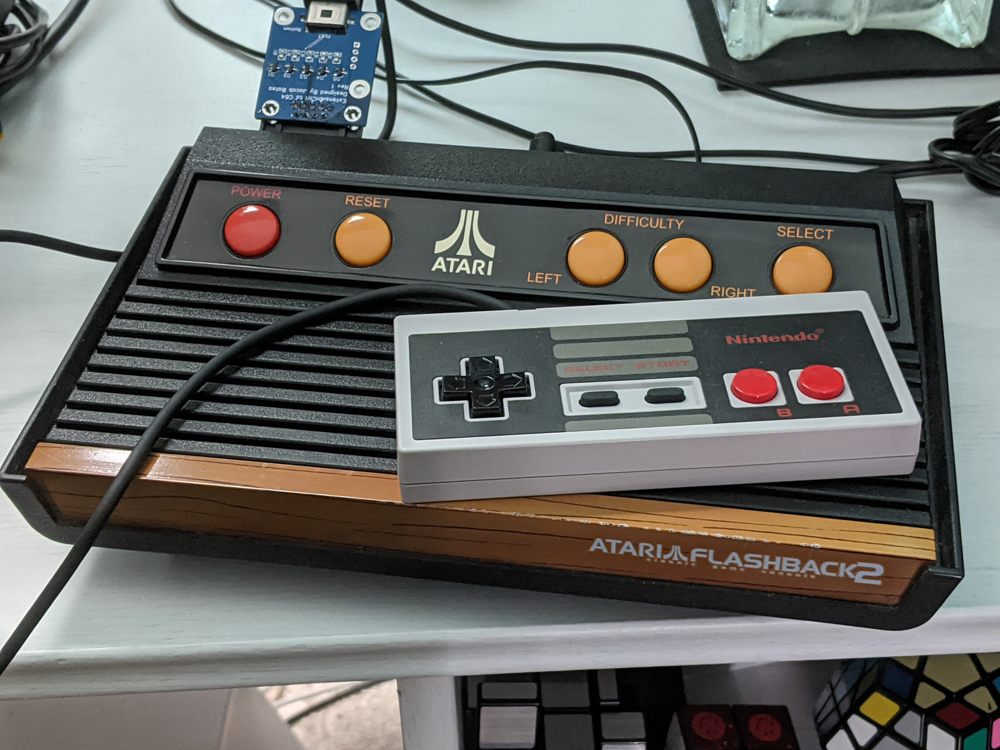

# Nintendo Extension Controller to Atari/Commodore 64 Adapter

This board will allow you to use a Nintendo Extension Controller with your original Atari or Commodore computers/consoles that use the [Atari Joystick Port](https://en.wikipedia.org/wiki/Atari_joystick_port).  Specifically, this adapter supports game controllers meant for the NES and SNES Classic Edition consoles.

## Bill of Materials

There are two different versions of this board.  One uses a [Seeeduino Xiao](https://www.seeedstudio.com/Seeeduino-XIAO-Arduino-Microcontroller-SAMD21-Cortex-M0+-p-4426.html), and the other uses an [ATtiny1604](https://www.microchip.com/wwwproducts/en/ATtiny1604).  Both versions use surface-mount components, with the exception of the D-Sub connector and any optional headers.  Both versions use the same software and output pin numbers.

### Seeeduino Xiao Version

| Label | Quantity | Description |
| ----- | -------- | ----------- |
| U2    | 1        | Seeeduino Xiao |
| JP1   | 1        | D-Sub Recepticle (female), 9 position, right-angle, through-hole |
| R1-R5 | 5        | 47k Ohm Resistor, 1/4 watt, 0805 package, surface-mount |
| Q1-Q5 | 5        | BC847 NPN Transistor, SOT23-3 package, surface-mount |

### ATtiny1604 Version

| Label | Quantity | Description |
| ----- | -------- | ----------- |
| U1    | 1        | ATtiny1604, 14SOIC package, surface-mount |
| U3    | 1        | MCP1825 3.3v 500mA Linear Regulator, SOT223-3 package, surface-mount |
| JP1   | 1        | D-Sub Recepticle (female), 9 position, right-angle, through-hole |
| R1-R5 | 5        | 47k Ohm Resistor, 1/4 watt, 0805 package, surface-mount |
| Q1-Q5 | 5        | BC847 NPN Transistor, SOT23-3 package, surface-mount |

## Why Surface Mount?

This project is designed to be the easiest way to get into surface-mount (smd) soldering.  The Seeeduino Xiao version has parts on both sides of the board, meaning that manual or hot air soldering can be used.  The ATtiny1604 version only has parts on a single side of the board, meaning you can use a reflow oven.  So far, I have only built these boards by hand using a fine-tip soldering iron, magifying glasses, tweezers, and 0.3mm solder.  Since I have not tried hot air soldering or using a reflow oven, I may be talking out of my butt.  Please try them out and let me know!

In order to make this project as easy as possible to solder, large smd parts were selected, and the parts were given relatively generous spacing.  That being said, you probably want to mount C1 and C2 before U1 and U3.

If you make an entirely through-hole version of this project, please let me know!

## Libraries required

* [NintendoExtensionCtrl](https://github.com/dmadison/NintendoExtensionCtrl) by dmadison

## Compatible Controllers

* NES Classic Controller
* SNES Classic Controller
* Wii Classic Controller
* Wii Pro Controller

## Controller layout

Keep in mind that only the D-pad, A, and B buttons are mapped by default.  The rest of the buttons are detected by the microcontroller, but they are not sent to the Atari/Commodore because there is no hardware for those buttons.  However, you can customize the firmware to turn those extra buttons into turbo buttons or switch layouts.  By default, the layout is:

| Controller | Atari Joystick Port |
| ---------- | ------------------- |
| Up         | Up                  |
| Down       | Down                |
| Left       | Left                |
| Right      | Right               |
| B          | Fire                |
| A          | Up                  |

## Programming the Arduino

1. Open [ExtensionCtrl_Adapter.ino](ExtensionCtrl_Adapter/ExtensionCtrl_Adapter.ino) in your Arduino IDE.
2. Install the NintendoExtensionCtrl library.
3. Plug the Seeeduino Xiao into your computer.
4. Click **Upload**.

Reprogramming can be done in-circuit, so ther is no need to remove the Xiao from the board to change the firmware.

### Notes specific to the ATtiny1604

The ATtiny1604 supports UPDI programming, which can be accomplished via a dedicated programmer, or [building your own out of an Arduino Nano](https://www.youtube.com/watch?v=AL9vK_xMt4E).  The programming process is the same, except you will connect a single wire to the UDPI pin (pin 10).  All of the pins on the ATtiny1604 have been broken out into 2.54mm headers for convenient programming and extension.

## Additional Images

